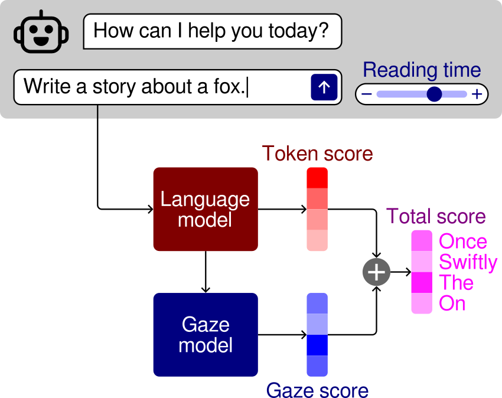

# Gaze-controlled text generation

This repository contains the code for reproducing the results and figures in the paper [_Controlling Reading Ease with Gaze-Guided Text Generation_](https://doi.org/10.18653/v1/2026.eacl-long.107) (EACL 2026).

<p align="center">
    
    <br>
    <a href="https://doi.org/10.18653/v1/2026.eacl-long.107" style="font-weight: bold">📄 Paper</a>
    | <a href="https://osf.io/rhgbk" style="font-weight: bold">💾 Dataset</a>
</p>

## Contents

**Code:**

- `gaze_model.ipynb`: Code for reproducing the gaze model training
- `generate.py`/`generate_all.sh`: Scripts for generating the texts
- `analysis.ipynb`: Code for reproducing the statistical analysis and figures
- `modeling/`: Modules for data preprocessing, model training, and text generation

**Data:**

- `emtec/`: Scripts for downloading and converting the EMTeC dataset ([Bolliger et al., 2024](https://doi.org/10.3758/s13428-025-02677-4))
- `eyetracking/`: Preprocessed gaze data from the eye-tracking study (corresponds to `gaze/measures/cleaned.zip` in the [dataset repository](https://osf.io/rhgbk))
- `responses/`: Response data from the eye-tracking study (comprehension questions and ratings; corresponds to `responses/responses.csv` in the [dataset repository](https://osf.io/rhgbk))

**Outputs:**

- `models/`: Trained gaze models
- `stories/prompts.jsonl`: Story prompts used for generating the texts
- `stories/output-Llama-3B`: Generated texts
- `paper/figures/`: Figures generated by the analysis notebook

## Reproducing results

### Requirements and setup

- Install Python >= 3.12
- `pip install -r requirements.txt`

### Gaze model training

[`gaze_model.ipynb`](gaze_model.ipynb) contains all the code necessary to train and evaluate the GPT-2-based gaze model used in the paper, as well as the linear regression baseline.

The trained models are also included in the [`models`](models) directory. Retraining the models is not necessary for generating texts in the next section.

### Text generation

Running `generate_all.sh` will reproduce the texts with the settings described in the paper. A GPU with about 80GB of memory is recommended.

To generate texts with other settings, use `generate.py`:

```bash
python generate.py \
    --prompts stories/prompts.jsonl \
    --language-model <hugging-face-model-name> \
    --gaze-model <gaze-model-name> \
    --gaze-weight <gaze-weight> \
    --beam-size <beam-size> \
    --gpu <device-id> \
    > output.jsonl
```

- `<hugging-face-model-name>` can be any instruction-tuned language model on the Hugging Face Hub (or local)
- `<gaze-model-name>` can be `trf` (transformer) or `lr` (linear regression)
- `<gaze-weight>` can be any real number
- `<beam-size>` can be any positive non-zero integer
- `<device-id>` refers to the CUDA device IDs (comma-separated) for the GPUs to use (will be passed to `CUDA_VISIBLE_DEVICES`)
- `--verbose` can be added to print the beam with the highest total score at each generation step

### Analysis

[`analysis.ipynb`](analysis.ipynb) contains all the code necessary to reproduce the statistical analyses and figures in the paper.

## Citation

Please cite [this paper](https://doi.org/10.18653/v1/2026.eacl-long.107) if you use the code or data in this repository:

```bibtex
@inproceedings{sauberli-etal-2026-controlling,
    title = "Controlling Reading Ease with Gaze-Guided Text Generation",
    author = {S{\"a}uberli, Andreas and Jepifanova, Darja and Frassinelli, Diego and Plank, Barbara},
    editor = "Demberg, Vera and Inui, Kentaro and Marquez, Llu{\'i}s",
    booktitle = "Proceedings of the 19th Conference of the {E}uropean Chapter of the {A}ssociation for {C}omputational {L}inguistics (Volume 1: Long Papers)",
    month = mar,
    year = "2026",
    address = "Rabat, Morocco",
    publisher = "Association for Computational Linguistics",
    url = "https://aclanthology.org/2026.eacl-long.107/",
    doi = "10.18653/v1/2026.eacl-long.107",
    pages = "2383--2397",
    ISBN = "979-8-89176-380-7"
}
```

## License

- The code in this repository is licensed under MIT.
- The dataset containing the generated texts, eye-tracking and response data is available [here](https://osf.io/rhgbk) and licensed under CC-BY-NC.
- The EMTeC dataset is available [here](https://osf.io/ajqze) and licensed under CC-BY.
